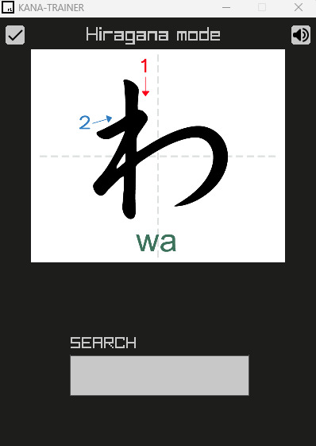

# JAP-TESTER

A simple app to learn and practice hiragana.

## Building instructions

I built everything using Windows 10

* Install [Raylib](https://www.raylib.com/)

* Clone this repo

* From the Explorer Window of VS Code navigate to the src folder and double click on the main.cpp file.

* Press F5 on the keyboard to compile and run the program.

# App Instructions

* Use left and right key to change the kana.
* To use the textbox write a kana and press space.
* To change mode press enter.

# Preview

  

